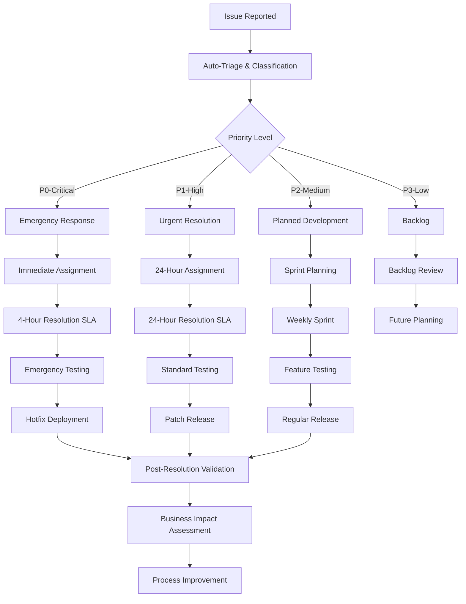

# CarBot Systematic Issue Resolution Workflow

## Overview

This workflow establishes systematic processes for resolving CarBot production issues based on business impact priority. The framework ensures rapid response to revenue-blocking issues while maintaining quality and preventing regression.

## Issue Lifecycle Workflow



## Priority-Based Resolution Workflows

### P0 - CRITICAL: Emergency Response Protocol

#### Immediate Actions (Within 1 Hour)
1. **Auto-Assignment**
   - Repository owner + technical lead
   - Slack/email notifications to all stakeholders
   - Create emergency war room (if needed)

2. **Impact Assessment**
   - Quantify revenue impact (€/hour)
   - Identify affected customers (count/percentage)
   - Document business justification for emergency response

3. **Initial Triage**
   - Reproduce issue in production environment
   - Identify root cause category (auth, database, deployment)
   - Determine if rollback is immediate option
   - Establish workaround if possible

#### Resolution Phase (Hours 1-4)
4. **Emergency Development**
   - Single developer focus (no parallel work)
   - Minimal viable fix approach
   - Direct commits to main branch (if necessary)
   - Continuous stakeholder communication

5. **Emergency Testing**
   - Production-like environment testing
   - Core user journey validation
   - Basic smoke tests only
   - Risk assessment for deployment

6. **Hotfix Deployment**
   - Zero-downtime deployment if possible
   - Production monitoring dashboard active
   - Rollback plan ready and tested
   - Customer communication prepared

#### Post-Resolution (Hours 4-8)
7. **Validation & Monitoring**
   - End-to-end user journey testing
   - Revenue system functionality verification
   - Customer access rate monitoring
   - Error rate and performance metrics

8. **Communication & Documentation**
   - Customer notification (if needed)
   - Stakeholder status update
   - Incident post-mortem scheduling
   - Root cause analysis documentation

#### Success Criteria for P0 Resolution
- [ ] Customer access rate: 100% (from 0%)
- [ ] Revenue system functionality: Fully operational
- [ ] Core user journeys: 100% success rate
- [ ] System stability: No related errors for 24 hours
- [ ] Business impact: Revenue potential fully restored

### P1 - HIGH: Urgent Resolution Protocol

#### Initial Response (Within 4 Hours)
1. **Assignment & Planning**
   - Assign to repository owner or senior developer
   - Create detailed resolution plan
   - Estimate complexity and timeline
   - Schedule stakeholder updates

2. **Technical Analysis**
   - Detailed root cause analysis
   - Impact assessment on related systems
   - Testing strategy development
   - Deployment plan creation

#### Resolution Phase (Hours 4-24)
3. **Development & Testing**
   - Feature branch development
   - Comprehensive testing suite
   - Code review by secondary developer
   - Integration testing

4. **Deployment Preparation**
   - Staging environment validation
   - Production deployment plan
   - Monitoring and alerting setup
   - Rollback procedures documented

#### Deployment & Validation (Hours 24-48)
5. **Production Release**
   - Scheduled maintenance window (if needed)
   - Gradual rollout strategy
   - Real-time monitoring
   - Customer impact assessment

6. **Post-Deployment Monitoring**
   - 48-hour stability monitoring
   - Business metrics validation
   - Customer feedback collection
   - Performance impact assessment

### P2 - MEDIUM: Planned Development Workflow

#### Sprint Planning Integration
1. **Backlog Prioritization**
   - Business value assessment
   - Development effort estimation
   - Dependencies identification
   - Sprint assignment

2. **Development Process**
   - Standard development workflow
   - Full testing suite
   - Code review requirements
   - Documentation updates

3. **Release Planning**
   - Regular release cycle
   - Full regression testing
   - Customer communication
   - Feature rollout strategy

### P3 - LOW: Future Enhancement Pipeline

#### Backlog Management
1. **Quarterly Review**
   - Business value reassessment
   - Technical debt evaluation
   - Market opportunity analysis
   - Resource allocation planning

## Resolution Templates

### P0 Emergency Response Checklist

```markdown
# P0 EMERGENCY RESPONSE CHECKLIST

## Initial Response (Hour 1)
- [ ] Issue reproduced and confirmed
- [ ] Business impact quantified (€/hour loss)
- [ ] Emergency team assembled
- [ ] Stakeholders notified
- [ ] War room established (if needed)

## Triage Analysis (Hour 1-2)
- [ ] Root cause identified
- [ ] Rollback option evaluated
- [ ] Workaround possibility assessed
- [ ] Resolution approach determined
- [ ] Timeline estimated

## Resolution Execution (Hour 2-4)
- [ ] Fix developed and tested
- [ ] Code reviewed (if possible)
- [ ] Deployment plan confirmed
- [ ] Monitoring setup prepared
- [ ] Rollback plan ready

## Deployment & Validation (Hour 4-6)
- [ ] Fix deployed to production
- [ ] Smoke tests completed
- [ ] Customer access validated
- [ ] Revenue system tested
- [ ] Error monitoring active

## Post-Resolution (Hour 6-8)
- [ ] Full system validation completed
- [ ] Customer communication sent
- [ ] Incident documentation created
- [ ] Post-mortem scheduled
- [ ] Process improvements identified
```

### Business Impact Validation Template

```markdown
# BUSINESS IMPACT VALIDATION

## Pre-Resolution State
- Revenue impact: €[amount]/[timeframe]
- Customer accessibility: [percentage]%
- System functionality: [description]
- Error rates: [metrics]

## Post-Resolution State
- Revenue impact: RESOLVED / €[remaining impact]
- Customer accessibility: [percentage]%
- System functionality: [description]
- Error rates: [metrics]

## Success Metrics
- [ ] Revenue potential restored: [€amount]
- [ ] Customer access rate: [target]% achieved
- [ ] System stability: [hours] without issues
- [ ] Business objectives: [list] achieved

## ROI Analysis
- Resolution cost: [hours] × [rate] = €[total]
- Revenue restored: €[amount]/[timeframe]
- Break-even time: [calculation]
- ROI: [percentage]%
```

## Escalation Procedures

### P0 Escalation Path
1. **Hour 2**: If no progress, escalate to technical lead + CTO
2. **Hour 3**: If no resolution, consider external consultant
3. **Hour 4**: If SLA missed, executive escalation required
4. **Hour 6**: Customer communication and expectation management

### P1 Escalation Path
1. **Hour 12**: Progress review and resource reallocation
2. **Hour 18**: Technical lead intervention
3. **Hour 24**: SLA review and timeline adjustment
4. **Hour 36**: Stakeholder communication required

## Quality Gates

### P0 Emergency Quality Gates
1. **Minimum Viable Fix**: Core functionality restored
2. **Smoke Test**: Basic user journeys functional
3. **Business Validation**: Revenue systems operational
4. **Stability Check**: No immediate regressions

### P1 Standard Quality Gates
1. **Code Review**: Peer review completed
2. **Testing Suite**: Comprehensive tests pass
3. **Integration Testing**: No system regressions
4. **Performance Testing**: No performance degradation
5. **Documentation**: Resolution documented

## Metrics and Monitoring

### Resolution Metrics
- **Time to Resolution**: Track against SLA targets
- **Business Impact Restoration**: Revenue/customer metrics
- **Quality Impact**: Post-resolution error rates
- **Customer Satisfaction**: Feedback and retention

### Process Improvement Metrics
- **SLA Compliance**: Percentage of issues resolved within SLA
- **Escalation Frequency**: Frequency of escalation events
- **Recurring Issues**: Issues requiring multiple resolutions
- **Prevention Effectiveness**: Reduction in similar issues

## Tools and Automation

### Automated Responses
- **Issue Classification**: AI-powered priority assignment
- **Stakeholder Notification**: Automated email/Slack alerts
- **Monitoring Setup**: Automatic dashboard configuration
- **Documentation Generation**: Template-based incident reports

### Monitoring and Alerting
- **Production Health**: Real-time system health monitoring
- **Business Metrics**: Revenue and customer access tracking
- **Error Tracking**: Automated error detection and reporting
- **Performance Monitoring**: Response time and availability metrics

## Communication Templates

### P0 Customer Communication
```
Subject: [CarBot] Service Issue Resolution - Action Required

Dear [Customer],

We experienced a temporary service interruption that has been resolved. 

- Issue Duration: [start] - [end]
- Services Affected: [list]
- Resolution: [summary]
- Prevention: [measures taken]

We apologize for any inconvenience. Your data and account remain secure.

CarBot Team
```

### Stakeholder Update Template
```
Subject: [P0-RESOLVED] CarBot Production Issue - Business Impact Summary

Resolution Summary:
- Issue: [brief description]
- Duration: [hours]
- Business Impact: €[amount] potential revenue restored
- Customer Impact: [percentage]% customers affected
- Resolution: [summary]

Next Steps:
- [ ] Post-mortem review scheduled
- [ ] Process improvements identified
- [ ] Prevention measures implemented

ROI: Resolution cost €[amount], revenue restored €[amount]/month
```

This systematic workflow ensures rapid, quality resolution of production issues while maintaining clear communication and continuous process improvement.